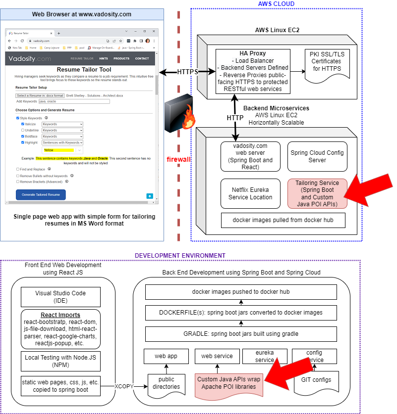

# React Components

The red arrows indicate how this project's build artifacts fit into the Resume-Tailor application architecture

</img>

The resume-tailor-core library is a pure Java 16 api that interfaces primarily with the Apache POI Apis to modify word documents. 

To build locally:
	
	gradle clean build

Functionality Includes:

- Attachment Handling  and File I/O

- Word Document parsing, modification and regeneration

- Key Word Formatting: Boldface, Italics, Underlining, Highlighting

- Search and Replace of words or phrases: Case-Insensitive

- Bullet Trimming

- Handling keywords in brackets

